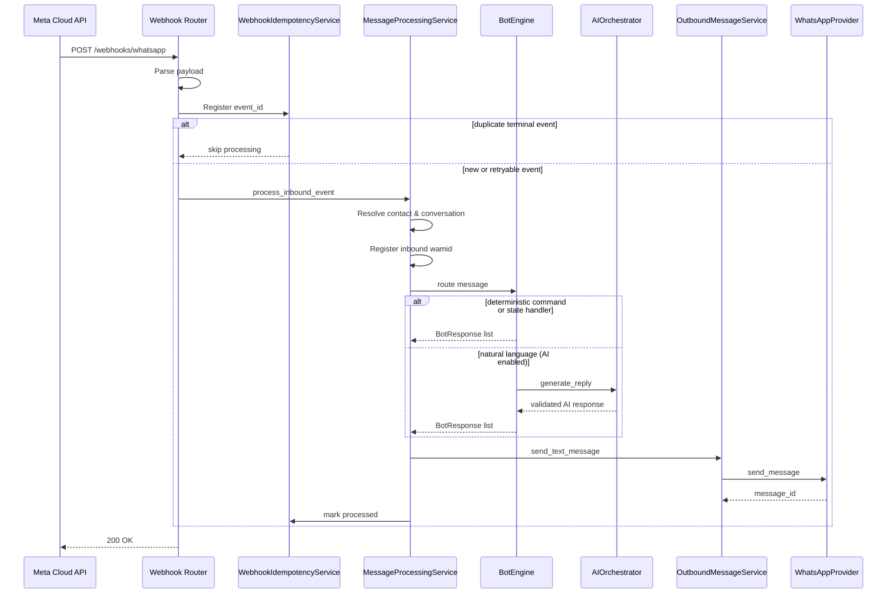

# Architecture

This document describes the **current implemented architecture**. For the long-term product plan, see `.cursor/plans/whatsapp_platform_architecture_5dab63e7.plan.md` (internal planning reference).

## System overview

Modular monolith:

| Component | Role | Status |
|-----------|------|--------|
| FastAPI API | Webhooks, health checks, future admin REST | Active |
| Bot engine | Deterministic message handling and state | Active |
| PostgreSQL 16 | Durable state (conversations, messages, events) | Active |
| Redis 7 | Readiness checks; future queue/cache | Connected |
| Next.js frontend | Admin shell | Scaffold only |
| Background worker | Async processing | Not implemented (inline processing today) |

## Request flow



## Layer boundaries

### 1. Webhook layer (`app/webhooks/`)

- Validates verification token (GET) and optional HMAC signature (POST).
- Parses JSON payload via provider/parser.
- Delegates to `InboundEventService`.
- Returns HTTP 200 quickly; does not call Meta.

### 2. WhatsApp provider layer (`app/whatsapp/`)

- **`WhatsAppProvider` protocol** — parse events, send messages.
- **`MockWhatsAppProvider`** — local dev and tests (default).
- **`MetaWhatsAppClient`** — Graph API adapter (requires credentials).
- Internal schemas: `WhatsAppInboundEvent`, `OutboundMessageRequest`, `OutboundMessageResult`.

The bot engine and webhook handlers never construct raw Meta HTTP requests.

### 3. Application services (`app/services/`)

| Service | Responsibility |
|---------|----------------|
| `InboundEventService` | Orchestrates webhook events through idempotency and message processor |
| `MessageProcessingService` | Full inbound pipeline: contact, conversation, bot, outbound |
| `WebhookIdempotencyService` | Event-level dedup on `webhook_events.event_id` |
| `MessageRepository` | Message-level dedup on `messages.wamid` |
| `ContactService` / `ConversationService` | Identity and conversation lifecycle |
| `OutboundMessageService` | Outbound sends with bounded retries |

### 4. Bot engine (`app/bot/`)

- **`InternalInboundMessage`** — channel-normalized input (no Meta types in handlers).
- **`BotResponse`** — channel-independent output (`type`, `text`, `metadata`).
- **`BotRouter`** — command registry + state-specific handlers (not a giant if/else chain).
- **`ConversationStateMachine`** — validates and persists state transitions.
- **Commands:** `/start`, `/help`, `/menu`, `/demo` (+ aliases without leading slash).
- **Default text handler** — routes natural-language messages to AI when enabled; deterministic fallback when disabled or on AI failure.
- **AI routing** — `/start`, `/help`, `/menu`, `/demo`, unknown commands, and state handlers (demo flow) never call AI.

### 5. AI layer (`app/ai/`)

- **`AIProvider` protocol** — `generate_response`, `generate_structured_response`.
- **`MockAIProvider`** — local dev and tests (default when `AI_PROVIDER=mock`).
- **`OllamaProvider`** — local Ollama `/api/chat` adapter (e.g. `phi3:mini`; `OLLAMA_REQUEST_TIMEOUT=120`).
- **`OpenAIProvider`** — httpx-based Chat Completions adapter (requires `OPENAI_API_KEY`).
- **`AIOrchestrator`** — limits, retries, validation, fallback; does not send WhatsApp messages or access secrets.
- **`ConversationContextBuilder`** — bounded recent message history with secret redaction.
- **Versioned prompts** — separate system instructions, business rules, context, and user message (`prompts/v1.py`).
- **`ToolRegistry`** — foundation for future typed tools (no dangerous tools registered).

Flow for natural-language text in `MAIN_MENU`:

```
MessageProcessingService → BotEngine → AITextHandler → AIOrchestrator → AIProvider → BotResponse
```

### 6. Persistence (`app/models/`)

| Table | Purpose |
|-------|---------|
| `webhook_events` | Webhook idempotency and processing status |
| `contacts` | Stable channel identity per business phone number |
| `conversations` | Conversation lifecycle (`active`, `paused`, `closed`) |
| `conversation_sessions` | JSONB state machine context |
| `messages` | Inbound/outbound records with processing status |
| `business_accounts`, `phone_numbers` | Business phone number registry |
| `admin_users` | Scaffold for future admin auth |

## Idempotency

Two persistent layers prevent duplicate bot execution:

1. **Event level** — `webhook_events.event_id` UNIQUE. Terminal statuses (`processed`, `unsupported`, `duplicate`) skip reprocessing. Failed events are retried on Meta webhook retry.
2. **Message level** — `messages.wamid` UNIQUE. Duplicate inbound messages skip bot execution when processing is terminal.

Both use database constraints. PostgreSQL uses `INSERT ... ON CONFLICT DO NOTHING`; SQLite uses constraint detection with retry.

## Failure handling

| Failure | Behavior |
|---------|----------|
| Malformed payload | 400 or counted as parse error; no bot execution |
| Missing sender identity | Message ignored safely |
| Handler exception | Safe fallback response; logged internally |
| AI provider failure | Deterministic fallback message; logged without secrets |
| AI input/abuse limits | Deterministic limit message; no provider call |
| Outbound provider failure | Outbound message marked failed; inbound may be retried via webhook |
| Database unavailable | 503 from webhook; Meta will retry |
| Unsupported message type | Marked unsupported; no outbound reply |

Internal errors are not exposed to WhatsApp users.

## Transaction boundaries

Database transactions are **not** held open during outbound HTTP calls:

1. Persist inbound message and commit.
2. Run bot engine (in memory).
3. Persist session state and outbound intent; commit.
4. Send via provider (network).
5. Update delivery status; commit.

## Configuration

All configuration via environment variables (`app/core/config.py`). See `.env.example`.

Default provider: `WHATSAPP_PROVIDER=mock` — no external WhatsApp API calls.

Default AI: `AI_PROVIDER=mock` — no external AI API calls. Set `AI_PROVIDER=disabled` to use deterministic fallback only.

See `.env.example` for all AI environment variables.

## Implemented phases

| Phase | Scope |
|-------|-------|
| 0 — Foundation | App scaffold, health, DB, Docker, CI |
| 1 — WhatsApp integration | Provider, webhooks, idempotency, outbound retries |
| Bot engine | Commands, state machine, conversation persistence, message pipeline |
| AI layer | Provider abstraction, orchestrator, context, prompts, limits, tool foundation |

## Not yet implemented

- Admin REST API and authentication
- Background worker / queue-based processing
- Admin dashboard functionality
- Billing, analytics, `BotConfig` entity
- Production deployment manifests beyond Docker Compose
- AI tool execution (registry foundation only)
- Multi-provider AI routing per tenant/bot

## API documentation

FastAPI auto-generates OpenAPI documentation when `ENVIRONMENT=development`:

- Swagger UI: `/docs`
- ReDoc: `/redoc`

No duplicate static API docs are maintained — use the generated OpenAPI as the source of truth.
